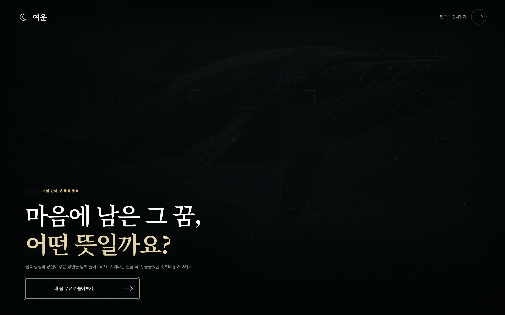

# 여운

꿈 내용과 감정을 입력하고 해석과 추가 질문을 이어가는 웹 서비스.

**현재 상태:** 개발 미리보기 공개 중

[서비스 열기](https://yeoun-dream-cosmic.vercel.app/) · [제품 설명](https://nodeoff.kr/products/yeoun) · [소스 저장소](https://github.com/dhjin1125/yeoun)

## 개발 환경에서 실행

Node.js 24 이상

```sh
npm ci
cp .env.example .env.local
npm run dev
```

`.env.local`에서 저장소 암호화·서명 키와 사용할 AI 제공자를 설정하세요. 공개 저장소에는 운영 데이터, 비밀 키, 연구용 수집 자료가 포함되지 않습니다. 현재 서비스는 Vercel과 별도 저장 서버를 함께 사용합니다. 직접 배포할 때 `next.config.ts`의 프록시 주소를 자신의 서버에 맞추세요.

## 운영자 정보

- 상호: 노드오프
- 대표: 진동현
- 사업자등록번호: 502-60-03676
- 운영 지역: 인천광역시
- 문의: [jin@nodeoff.kr](mailto:jin@nodeoff.kr)
- 회사 홈페이지: [nodeoff.kr](https://nodeoff.kr)

현재 개발 상태와 공개 주소는 회사 홈페이지와 함께 관리합니다.

## 공개 이력과 개발 경과

2026년 10월 7일 기존 비공개 작업을 정리해 처음 공개한 저장소입니다. 개발 시작일과 공개 커밋 날짜는 다릅니다. [개발 경과와 공개 범위](docs/development-history.md)를 확인해 주세요.

## Screenshot



Captured from the actual public website on 2026-10-07. This is a point-in-time view; sample UI illustrations on the company homepage are labeled as illustrations.
